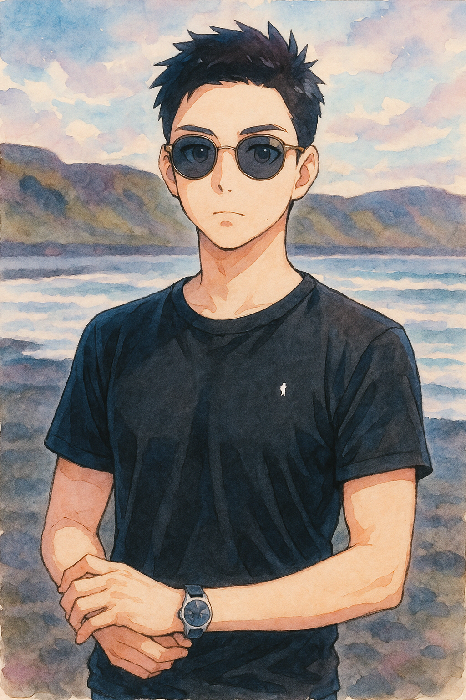
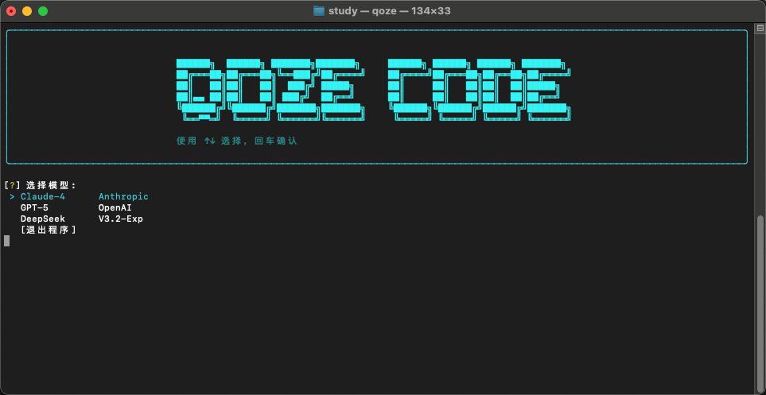
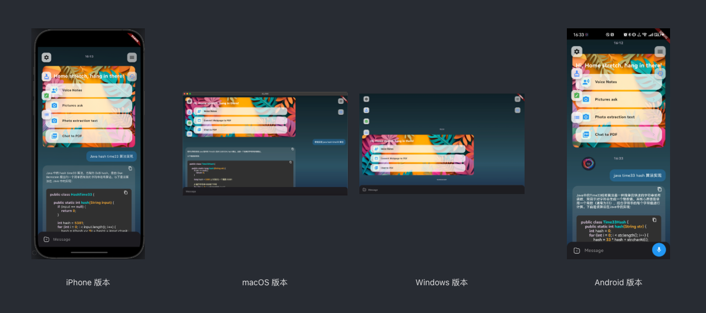
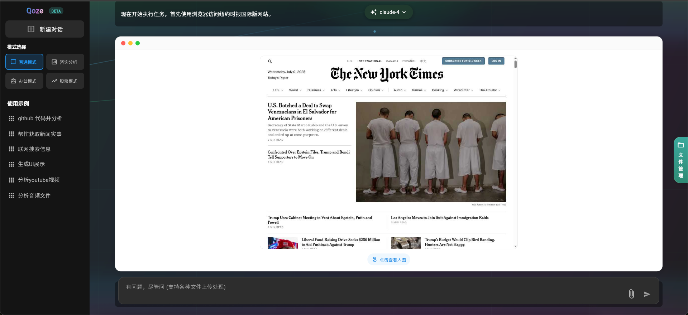

# 👋 Hi, I'm Nanman Kylin

## 🚀 About Me

<div style="text-align: center; margin: 20px 0;">
  
</div>

- 资深服务端工程师 & AI应用工程师 & 创新产品原型开发工程师
- 拥有中大型海外社交/AI工具 产品研发经验 (tiya, buz , owll , deeptran, PrivateNote,PlantAI 等等)
- 目前就职于纳斯达克上市公司 **SoundGroup**
- 热爱开源项目，致力于技术创新

## 💼 Professional Experience

### Backend Development

- 丰富的C端产品服务开发经验，擅长根据需求设计服务架构
- 丰富的云原生开发经验，熟悉 GCP | AWS | Azure 云厂商服务特性
- 能独立设计开发高并发系统的业务指标架构
- 熟悉 Kubernetes | Docker | Cloud Run 等快速落地云原生技术
- 曾主导团队从0到1打造多个AI工具产品POC，具备丰富的产品管理、PMF验证和ASO优化经验

### 🤖 AI Development Expertise

- **产品经验**：主导全球化ChatBot（13+语言语音交互）、独立开发AI Agent原型，累计参与12+个AI产品落地
- **核心技术**：音频处理全栈（ ASR / VAD / TTS / RTC / 转录纠正）、RAG/Embedding、AI Agent容器化部署
- **平台能力**：OpenAI / Bedrock / Azure / GCP 等主流AI平台

### 🌱 Currently Learning

- **云原生AI部署**：探索K8s、微服务在AI产品中的应用实践
- **前沿AI技术**：跟踪LLM、多模态AI及音频AI的最新发展
- **Agent进化**：研究AI Agent架构优化与能力边界突破
- **行业趋势**：关注AI技术的商业化落地与产品创新

## 🛠️ Tech Stack

```
Languages:    Java | Python | JavaScript | TypeScript | Flutter
Cloud:        GCP | AWS | Azure
AI/ML:        OpenAI | Vertex-AI | Bedrock | RAG | Embedding
DevOps:       Kubernetes | Docker | Cloud Run | AWS lambda | AWS S3 | AWS RDS
Audio:        ASR | VAD | WebRTC | TTS
```

## 🚀 Personal Projects

### [QozeCode 终端 AI Agent](https://github.com/KylinShinlyLin/QozeCode)

- 提高研发效率和帮你管理电脑的 AI agent

<div style="text-align: center; margin: 20px 0;">
  
</div>

### [Qoze - AI 工具](https://68d30a9594728bc39aa24be94b319d21.nebulab.app)

- flutter + 安卓原生开发的 AI工具

<div style="text-align: center; margin: 20px 0;">
  
</div>

### [Prism - 通用AI Agent原型](https://prism-f2e36.web.app/)

- 自主开发的通用AI Agent产品原型

<div style="text-align: center; margin: 20px 0;">
  
</div>

### [TimerSpace - 工作提效工具](https://timerspace.com/)

- 基于Flutter开发的工作效率提升产品

<div style="text-align: center; margin: 20px 0;">
  
</div>
