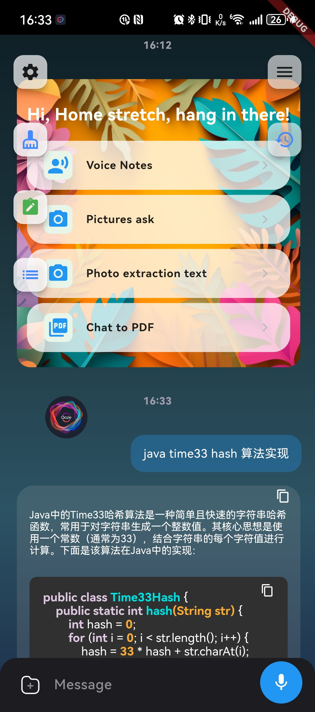
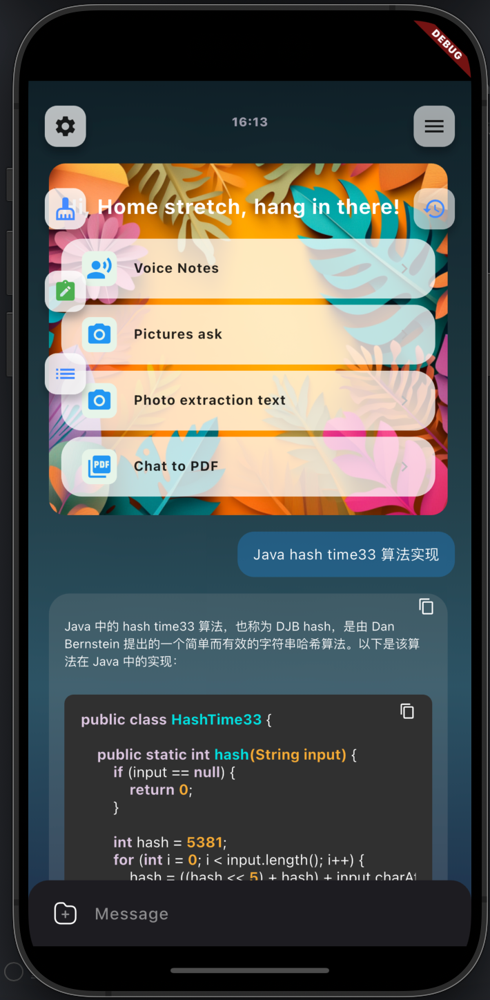
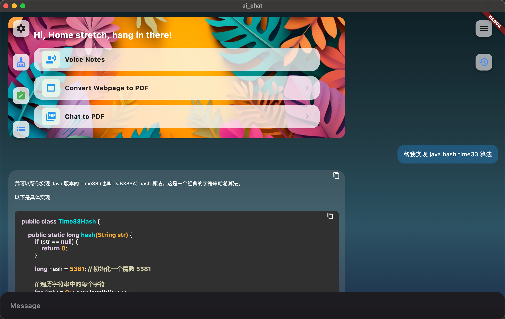
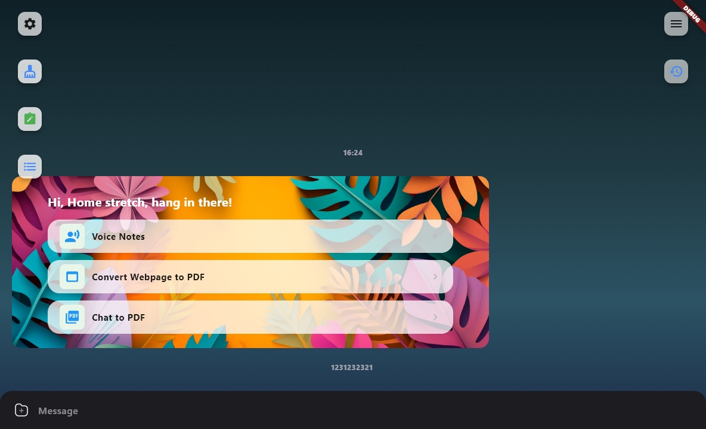

# 👋 Hi, I'm Nanman Kylin

## 🚀 About Me

- 资深服务端工程师 & AI应用工程师
- 拥有中大型海外社交产品研发经验 (tiya, buz 等)
- 目前就职于纳斯达克上市公司 **SoundGroup**
- 热爱开源项目，致力于技术创新

## 💼 Professional Experience

### Backend Development
- 丰富的C端产品服务开发经验，擅长根据需求设计服务架构
- 丰富的云原生开发经验，熟悉 GCP | AWS | Azure 云厂商服务特性
- 能独立设计开发高并发系统的业务指标架构
- 熟悉 Kubernetes | Docker | Cloud Run 等容器化技术
- 有丰富的 DevOps 开发经验

### 🤖 AI Development Expertise
- 能独立开发通用性 AI Agent 产品原型
- 在 ASR | VAD 等音频处理方面有丰富经验
- 至今参与 **12+** 个 AI 产品落地项目
- 开发过 WebRTC 方向的 chatbot 产品
- 熟悉 OpenAI | Bedrock | Azure | GCP(Vertex-AI) 等厂商AI能力
- 有 RAG | Embedding 在产品中落地的研发经验
- 熟悉 Coze | Dify 等AI应用开发平台
- 设计过 AI Agent 使用的沙盒虚拟机容器
- 熟悉 TTS ssml，在 TTS上也有丰富的项目经验 
- 开发过支持 13种语言 以上的 chatbot 产品

## 🌱 Currently Learning

- 探索最新的云原生技术栈
- 关注 LLM 和多模态AI 发展趋势
- 关注音频AI技术发展趋势

## 🛠️ Tech Stack

```
Languages:    Java | Python | JavaScript | TypeScript
Cloud:        GCP | AWS | Azure
AI/ML:        OpenAI | Vertex-AI | Bedrock | RAG | Embedding
DevOps:       Kubernetes | Docker | Cloud Run
Audio:        ASR | VAD | WebRTC | TTS
```

## 🚀 Personal Projects

### [Qoze - AI 工具](https://68d30a9594728bc39aa24be94b319d21.nebulab.app)
<div style="display: flex; justify-content: space-between; align-items: flex-start; gap: 10px;">
  <div style="text-align: center; width: 15%;">
    
    <div style="margin-top: 8px; font-size: 14px;">Android</div>
  </div>
  <div style="text-align: center; width: 15%;">
    
    <div style="margin-top: 8px; font-size: 14px;">iPhone</div>
  </div>
  <div style="text-align: center; width: 23%;">
    
    <div style="margin-top: 8px; font-size: 14px;">macOS</div>
  </div>
  <div style="text-align: center; width: 23%;">
    
    <div style="margin-top: 8px; font-size: 14px;">Windows</div>
  </div>
</div>


### [Prism - 通用AI Agent原型](https://prism-f2e36.web.app/)
- 自主开发的通用AI Agent产品原型
<div style="text-align: center; margin: 20px 0;">
  
</div>


### [TimerSpace - 工作提效工具](https://timerspace.com/)
- 基于Flutter开发的工作效率提升产品
<div style="text-align: center; margin: 20px 0;">
  
</div>