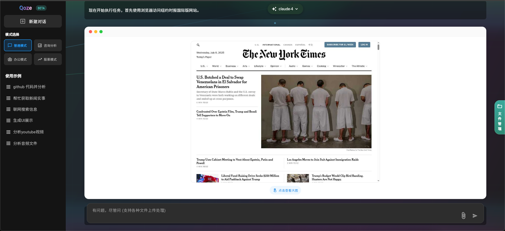

# 👋 Hi, I'm Nanman Kylin

<div style="text-align: center; margin: 20px 0;">
  
</div>

> **资深服务端架构师 | 跨端全栈开发者 | AI 产品创新者**
> 目前就职于纳斯达克上市公司 **SoundGroup**，专注于全球化社交与 AI 工具产品研发。

## 🚀 About Me

- **全球化与云原生架构**：深耕服务端架构设计，具备丰富的**海外多区域（Multi-region）**分布式服务部署经验。深度依赖并熟悉 **Google Cloud (GCP)** 等云原生生态体系。
- **复杂业务系统落地**：对 **IM（即时通讯）** 系统架构设计有深厚积累，熟练解决高并发、长连接、消息可靠性等核心痛点，并成功落地于实际业务中。
- **跨平台全栈能力**：精通 **Flutter** 跨端开发，具备 **iOS / Android / Windows / macOS** 多平台应用与工具软件的完整开发交付能力。
- **敏捷创新与商业落地**：极强的技术攻坚与工程化能力，曾多次主导各类 POC（概念验证）项目，帮助公司快速跑通多个核心产品的 **MVP（最小可行性产品）**。
- **AI 与前沿技术洞察**：对 AI 能力及产品演进形态有深刻认知。在音频交互（**ASR / TTS**）、**Realtime WebRTC**、以及 AI 大模型（Agent / RAG）的商业化融合方面有丰富的实战经验。

---

## 💼 Core Competencies

### Backend & Cloud Native (后端与云原生)
- **全球化部署**：擅长应对出海业务挑战，主导设计高可用、低延迟的海外多节点 / 多区域容灾架构。
- **云原生生态**：熟练运用 K8s、Docker、Cloud Run 等技术，结合 GCP / AWS 平台特性，实现微服务的高效迭代与治理。
- **系统架构**：独立设计开发高并发系统，尤其在大型 IM 社交服务、长连接网关等领域有成熟落地经验。

### Cross-Platform & MVP Delivery (跨端开发与产品交付)
- **Flutter 专家**：能够脱离纯后端标签，运用 Flutter 独立构建高性能的移动端与桌面端（Windows/macOS）产品。
- **0到1孵化器**：深谙敏捷开发之道，无论是 AI 智能体应用还是复杂社交工具，均能以最高效的技术选型完成 POC 验证与 MVP 上线。

### AI & RTC (人工智能与音视频)
- **实时交互技术**：精通基于 WebRTC 的实时音视频通讯，结合 ASR、VAD、TTS 构建极低延迟的语音交互体验。
- **AI 产品化**：熟悉 OpenAI / Vertex-AI / Bedrock 等主流平台，对 AI Native 应用（如多语言 ChatBot、独立 AI Agent 原型）与传统非 AI 产品的结合点有独到见解，累计参与主导 12+ AI 产品落地。

---

## 🛠️ Tech Stack

```text
Architecture:   Microservices | Global Multi-region Deployment | IM System Design
Languages:      Java | Python | TypeScript | JavaScript | Dart
Client End:     Flutter (iOS / Android / Windows / macOS) | Web frontend
Cloud & DevOps: GCP | AWS | Azure | Kubernetes | Docker | Cloud Run | CI/CD
AI & RTC:       LLM (OpenAI / Bedrock / Vertex) | RAG | Agent | ASR | TTS | WebRTC
```

---

## 💡 Personal Projects

### [QozeCode 终端 AI Agent](https://github.com/KylinShinlyLin/QozeCode)

- 提高研发效率和帮你管理电脑的 AI agent

<div style="text-align: center; margin: 20px 0;">
  
</div>

### Qoze 跨平台AI 工具


<div style="display: flex; justify-content: center; align-items: center; margin: 20px 0; gap: 20px;">
  
  
</div>

### [Prism - 沙盒 agent](https://prism-f2e36.web.app/)

- 自主开发的通用AI Agent产品原型

<div style="text-align: center; margin: 20px 0;">
  
</div>

### [TimerSpace - 专注类 提效工具](https://timerspace.com/)

- 基于Flutter开发的工作效率提升产品

<div style="text-align: center; margin: 20px 0;">
  
</div>
